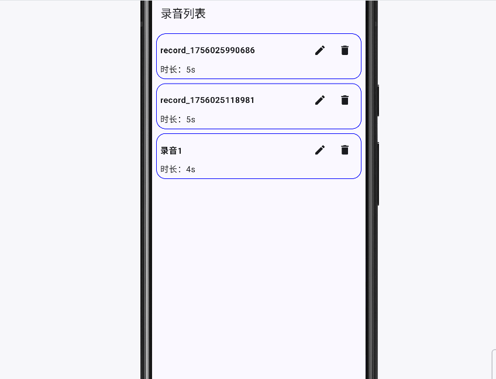
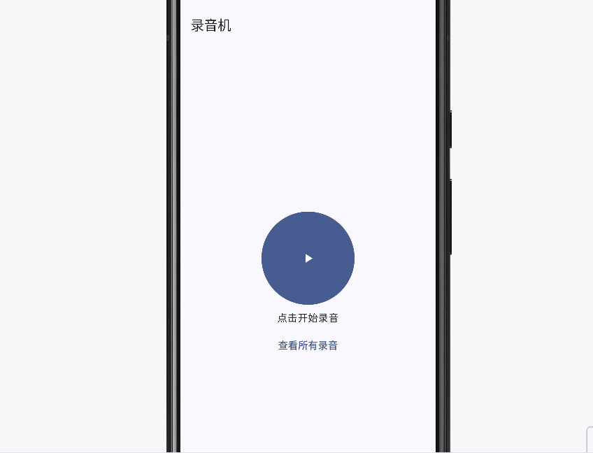

# Android Bubble Recorder  

[](README_ZH.md)

An Android voice recording app based on **Kotlin + Jetpack Compose**.  

## Features  

- **Voice Recording**  
  Implements recording functionality using `MediaRecorder`, with support for dynamic permission requests.  

- **Recording Playback**  
  Plays recorded files using `ExoPlayer`, with playback control features.  

- **Recording Management**  
  - Delete recording files  
  - Rename recordings  
  - Display local recording lists  

- **UI & Interaction**  
  - Builds a responsive UI with Jetpack Compose  
  - Custom `Toast` for operation result prompts  

- **Data Management**  
  - Stores local recording information using **Room**  
  - Manages state with **ViewModel + StateFlow**  
  - Uses **Hilt** for dependency injection  

- **Permission Management**  
  Dynamically requests recording and storage permissions, compatible with the latest Android versions.  

## Tech Stack  

- Kotlin + Jetpack Compose  
- MediaRecorder  
- ExoPlayer  
- Room Database  
- Hilt + ViewModel + StateFlow  
- Kotlin Coroutines  

## Future Plans  

- **Audio Trimming**  
  Support recording trimming and export operations using **FFmpeg**.  

- **File Management Optimization**  
  Support overwriting or saving as new files.  

## Project Structure  

```plaintext
app/src/main/java/com/chbgxn/bubblerecorder
├─ data/ # Models, Room database, DAO
├─ state/ # ViewModels
├─ ui/ # Compose screens and components
├─ util/ # Utility classes (recording, permissions)
├─ MyApplication.kt
└─ MainActivity.kt
```  

## Screenshots  

Requesting recording permission + Starting recording  

  

Playing a recording  

  

Renaming + Deleting a recording (Confirmation dialogs will be added in future versions)  

  

Permission request failed + Toast display  


