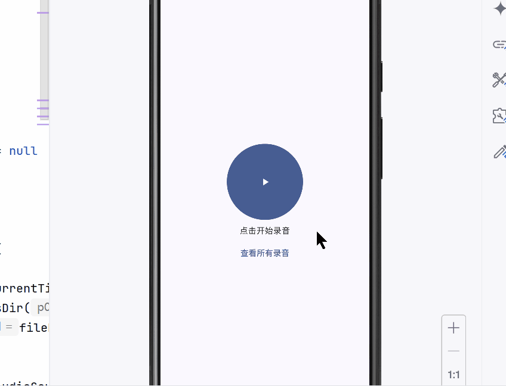
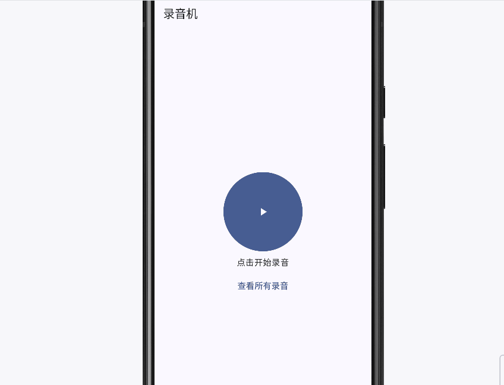

# Android Bubble Recorder

[](README.md)

一个基于 **Kotlin + Jetpack Compose** 的安卓录音应用。

## 功能特性

- **录音**  
  使用 `MediaRecorder` 实现录音功能，支持动态请求权限。

- **播放录音**  
  使用 `ExoPlayer` 播放录音文件，支持播放控制。

- **录音管理**  
  - 删除录音文件  
  - 修改录音名称  
  - 显示本地录音列表

- **UI 与交互**  
  - 使用 Jetpack Compose 构建响应式 UI  
  - 自定义`Toast`，支持通过 `Toast` 提示操作结果

- **数据管理**  
  - 使用 **Room** 存储本地录音信息  
  - 使用 **ViewModel + StateFlow** 管理状态  
  - 使用 **Hilt** 进行依赖注入

- **权限管理**  
  动态请求录音和存储权限，兼容最新 Android 版本。

## 技术栈

- Kotlin + Jetpack Compose  
- MediaRecorder  
- ExoPlayer  
- Room Database  
- Hilt + ViewModel + StateFlow  
- Kotlin Coroutines  

## 下一步计划

- **音频裁剪**  
  使用 **FFmpeg** 支持录音裁剪和导出操作  

- **文件管理优化**  
  支持覆盖或另存为新文件  

## 项目结构

```plaintext
app/src/main/java/com/chbgxn/bubblerecorder
├─ data/ # model、Room 数据库、DAO
├─ state/ # ViewModel
├─ ui/ # Compose 页面和组件
├─ util/ # 工具类（录音、权限）
├─ MyApplication.kt
└─ MainActivity.kt
```

## 截图

获取录音权限+开始录音



播放录音



更改录音名+删除录音（后续版本将增加操作确认弹窗）

\

获取权限失败+Toast 展示


